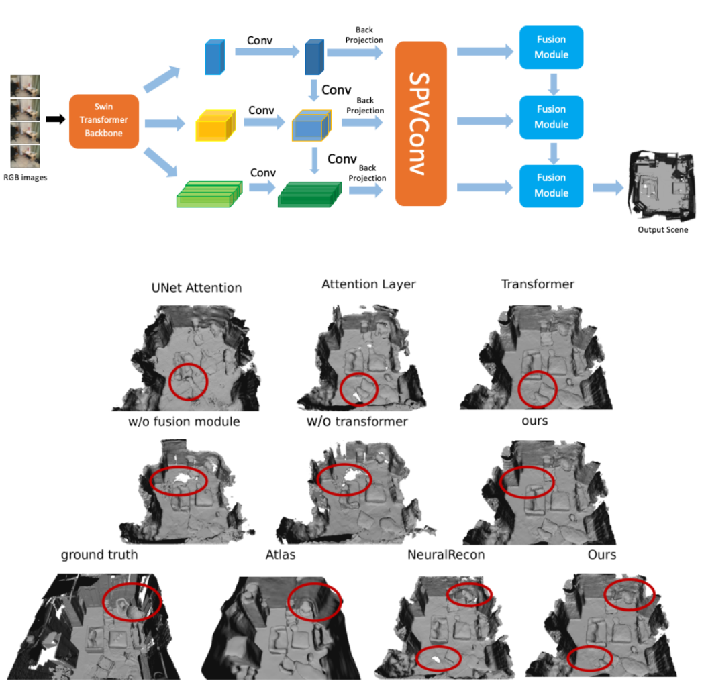

2021.10-2022.3

<b>Dongyue Lu</b>, Zhisheng Zheng   
Supervisor: Prof. Dr. Matthias Nießner   
Technical University of Munich 

<!-- 

 -->

 
Multi-view stereopsis is a significant topic in computer
vision. From an input monocular RGB video and camera
parameters, we reconstruct the surface geometry directly
by regressing a sparse TSDF volume. A Swin-Transformer
backbone is used to extract the most informative features
for downstream fusion tasks. Features of keyframes are
back-projected to 3D space, constructing a local window
for representing the local geometry. TSDF values are regressed using sparse convolution in a coarse-to-fine manner to ignore free space and increase computational efficiency. A transformer-based fusion module makes the local
reconstruction to be globally consistent with the previously
reconstructed windows. Our method is able to learn the local smoothness and global shape prior of 3D surfaces at
interactive rates. Experiments on ScanNet show that the reconstruction quality and efficiency of our method are comparable to current state-of-the-art methods.

[[Project report](http://dylanorange.github.io/files/mvs.pdf)]
[[code](https://github.com/DylanOrange/End-to-end-Learned-Multi-View-Stereo-Reconstruction-with-Transformers)]