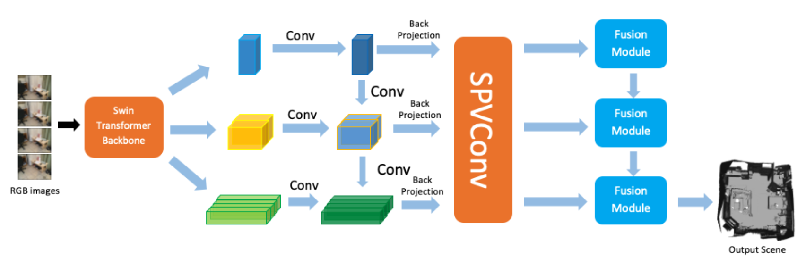
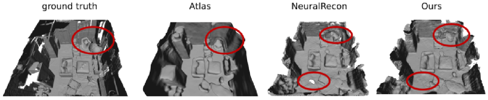
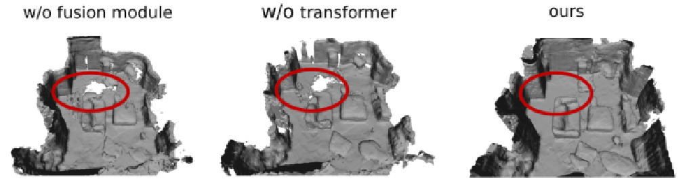
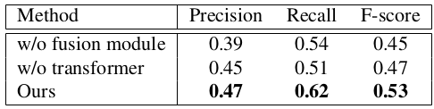

2021.10-2022.3

<b>Dongyue Lu</b>, Zhisheng Zheng   
Supervisor: Prof. Dr. Matthias Nießner   
Technical University of Munich 

---

<strong>Abstract</strong>

 
Multi-view stereopsis is a significant topic in computer
vision. From an input monocular RGB video and camera
parameters, we reconstruct the surface geometry directly
by regressing a sparse TSDF volume. A Swin-Transformer
backbone is used to extract the most informative features
for downstream fusion tasks. Features of keyframes are
back-projected to 3D space, constructing a local window
for representing the local geometry. TSDF values are regressed using sparse convolution in a coarse-to-fine manner to ignore free space and increase computational efficiency. A transformer-based fusion module makes the local
reconstruction to be globally consistent with the previously
reconstructed windows. Our method is able to learn the local smoothness and global shape prior of 3D surfaces at
interactive rates. Experiments on ScanNet show that the reconstruction quality and efficiency of our method are comparable to current state-of-the-art methods.

---

<strong>Overview</strong>

 
Given a set of RGB images with corresponding camera intrinsic parameters and extrinsic poses, our objective is real-time scene geometry reconstruction by predicting a global TSDF volume as the scene representation. We initiate the process by sampling incoming RGB frames, ensuring sufficient rotation and translation between frames. Keyframes within a window are selected, and a cube is constructed to encapsulate their view frustums within a specified depth range. Utilizing the Swin-Transformer for multi-level feature extraction, we incorporate an attention mechanism for information exchange. Extracted features are back-projected into a volume using camera parameters. Subsequently, we predict the TSDF and occupancy probability in each voxel in a coarse-to-fine manner, refining spatial features with sparse 3D convolution. The global feature volume is incrementally built at each level using a transformer module, fusing local and global features to avoid equal-weight treatment of individual frames. The network is supervised using occupancy loss and TSDF loss.

---

<strong>Result</strong>

<strong>Experiments on ScanNet Dataset</strong>

Our method exhibits comparable reconstruction performance to NeuralRecon and surpasses it in certain scenes. Atlas, as an offline method, tends to generate oversmoothed reconstructions, leading to inaccuracies. In terms of speed, both our method and NeuralRecon can operate at an interactive rate, offering significantly faster performance than Atlas.

<strong>Ablation studies</strong>

 

In the ablation studies, we explore two settings: completely removing the fusion module and employing a simple linear layer as the fusion module. Both settings result in inferior performance compared to our transformer module. The outcomes underscores the transformer module's capability to consider surrounding conditions and context.

 

---

[[Project report](http://dylanorange.github.io/files/mvs.pdf)]
[[code](https://github.com/DylanOrange/End-to-end-Learned-Multi-View-Stereo-Reconstruction-with-Transformers)]