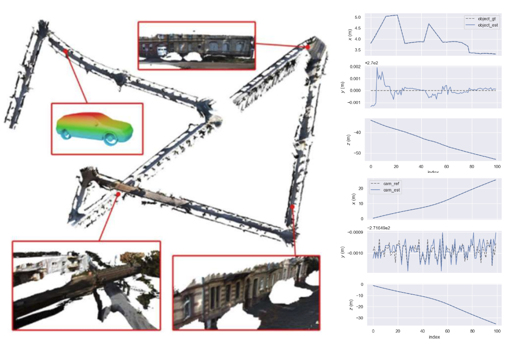
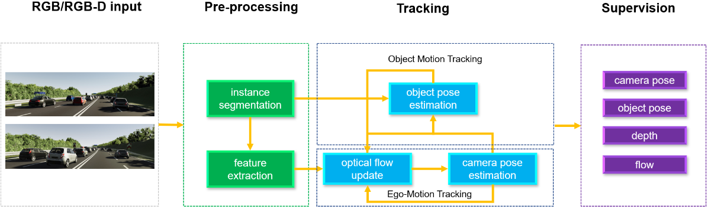
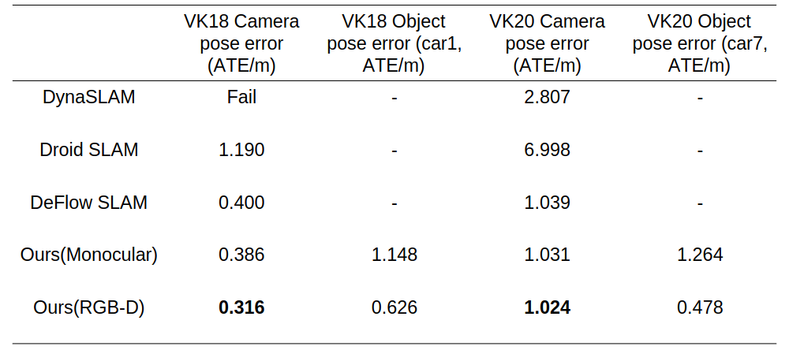
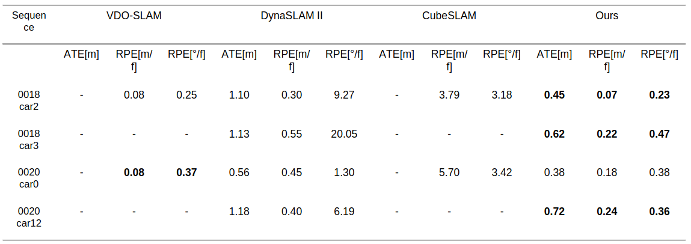

2022.5-2023.5

Dongyue Lu   
Supervisor: Dr. Xingxing Zuo, Prof. Dr. Stefan Leutenegger   
Technical University of Munich 

<!-- 

 -->

<strong>Abstract</strong>

 
We present a novel method for dynamic SLAM that combines classical optimization
techniques with deep learning to achieve high accuracy and robustness in estimating camera
poses, dynamic object poses, and scene depth in dynamic scenes. The
proposed approach leverages a state-of-the-art optical flow estimator with a GRU update
operator and instance segmentation to differentiate the dynamic regions from the static
background and individually track the poses of dynamic objects. To optimize both camera
and object poses, a differentiable dynamic dense bundle adjustment layer is introduced,
allowing for joint global refinement of camera poses, dynamic object poses, and depth maps
using a wider range of information from the entire image. Extensive experiments on the Virtual KITTI dataset demonstrate the great performance
of the proposed approach, even in the presence of severe occlusions and limited constraints.

<!-- Most existing SLAM methods focus on static scenes. However, to better understand the scene, the pose and shape of dynamic objects are also critical.
This project focuses on the pose and shape estimation of dynamic objects in a learned SLAM system.
A GRU update operator takes the extracted correlation features and context features as input and updates the optical flow iteratively.
After instance segmentation, the flow of static regions can be used to estimate camera pose, and dynamic regions are used to estimate dynamic object pose.
A differentiable dynamic dense bundle adjustment layer is constructed to jointly optimize camera pose and object pose and maximize their compatibility with current optical flow estimation. -->

<strong>Overview</strong>

 
The input images undergo a series of processing steps. First, they are passed through an iterative optical flow estimator to determine the correspondence between frames. Subsequently, the image is segmented using instance segmentation techniques. We then proceed to estimate the camera pose and dynamic object pose through a differentiable dynamic bundle adjustment layer, which is solved using a Gauss-Newton optimization approach. This layer produces depth and pose residuals to maximize the compatibility between the updated correspondence induced by depth and pose and the correspondence estimated by the network. The updated correspondence is then fed back into the optical flow estimator until the depth, pose, and flow converge.

<strong>Experiment on Virtual KITTI dataset</strong>

The proposed method utilizes information from dynamic areas that have been overlooked in prior research, and it achieves enhanced accuracy in camera pose estimation in monocular setting.

<strong>Experiment on KITTI Tracking dataset</strong>

When comparing the results of several selected object samples from previous studies, it can be observed that the estimation of dynamic object poses is significantly improved relative to DynaSLAM II and CubeSLAM.

[[Presentation](http://dylanorange.github.io/files/slides.pdf)]
[[code](https://github.com/DylanOrange/DROID-SLAM/tree/vkitti-allscene)]
<!-- [[Project report](http://dylanorange.github.io/files/mvs.pdf)]
[[code](https://github.com/DylanOrange/End-to-end-Learned-Multi-View-Stereo-Reconstruction-with-Transformers)] -->