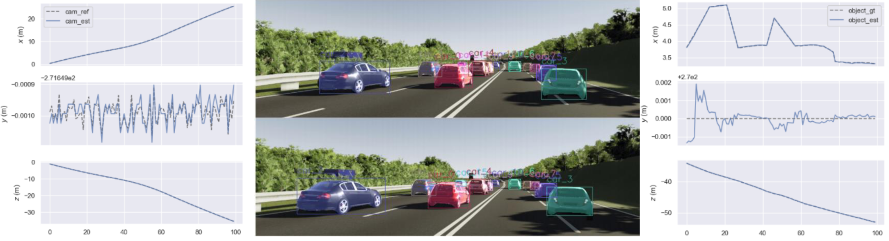

Ongoing

Dongyue Lu   
Supervisor: Dr. Xingxing Zuo, Prof. Dr. Stefan Leutenegger   
Technical University of Munich 

<!-- 

 -->

 
Most existing SLAM methods focus on static scenes. However, to better understand the scene, the pose and shape of dynamic objects are also critical.
This project focuses on the pose and shape estimation of the dynamic objects in a learned dense SLAM system.
A GRU update operator takes extracted correlation features and context features as input and updates optical flow iteratively.
After instance segmentation, the flow in the static region can be used to estimate the camera pose, and the dynamic region is used to estimate the dynamic object pose.
A differentiable dynamic dense bundle adjustment layer is constructed to jointly optimize camera pose and object pose and maximize their compatibility with current optical flow estimates.
Based on the already optimized object poses, object shapes are estimated through joint optimization using class-specific deep shape embeddings as priors.

<!-- [[Project report](http://dylanorange.github.io/files/mvs.pdf)]
[[code](https://github.com/DylanOrange/End-to-end-Learned-Multi-View-Stereo-Reconstruction-with-Transformers)] -->